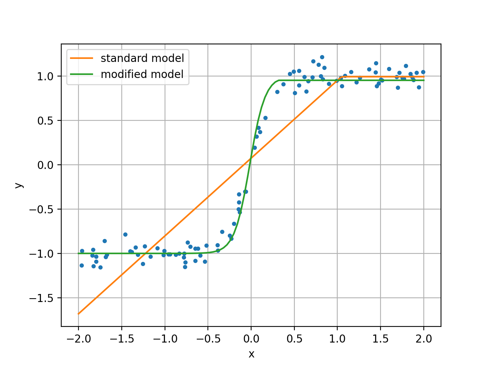

# sklearn-examples
Various examples and workarounds for working with the Python Scikit Learn machine learning library.

- [skl_MLP_test.py](skl_MLP_test.py) - demonstration of how to set the activation function in the output layer of an MLPRegressor model.

## Figure 1

